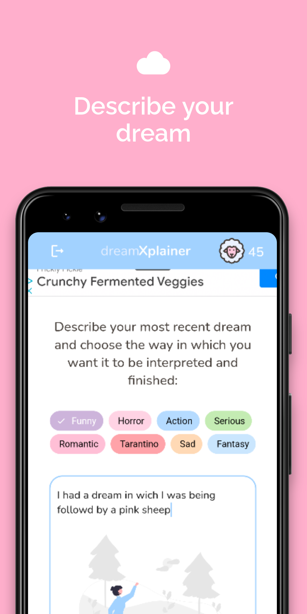
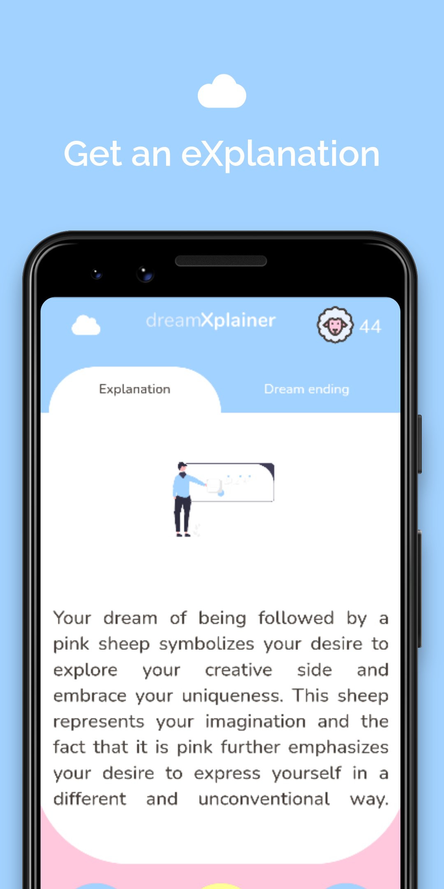
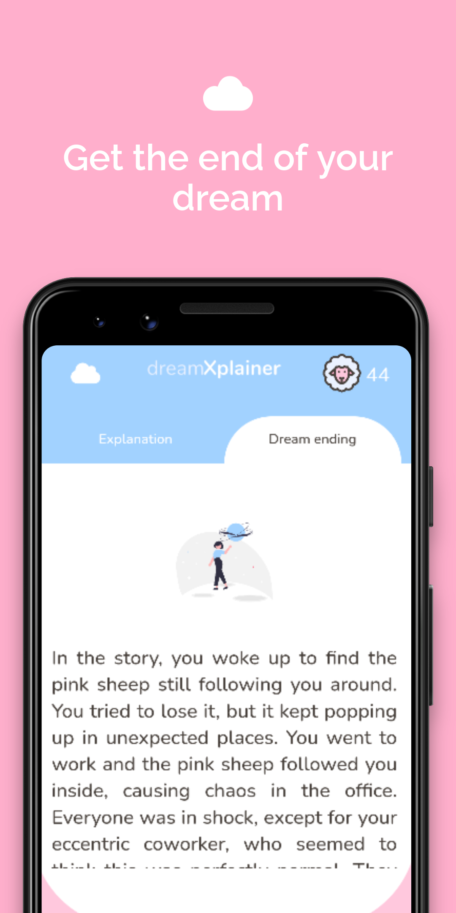

# dreamXplainer 🐑☁️

<p align="center">
  
</p>

<p align="center">
  eXplain the uneXplainable. 
</p>


## What is dreamXplainer?

**dreamXplainer** is a mobile application that helps you understand your _dreams_. It uses a machine learning model to analyze your dreams and provide you with an  <ins>explanation</ins> of what they might mean.


## Android App

This the open source code for the dreamXplainer Android App, previously on Play Store. Written in Flutter and using the openai api. Also integrates with adsense ads engine. It uses Firebase to handle users login and sign ins.

<p float="center">
  
   
  
  
</p>

## Open source

We decided to open source the project since we were not going to continue it. We deleted all api keys and tokens but you can put yours and it should work. 

## Instalation


```bash
git clone <repo> 
flutter create .
flutter build apk
``````


https://github.com/user-attachments/assets/abffd111-af1d-4708-9334-220b9102d867


